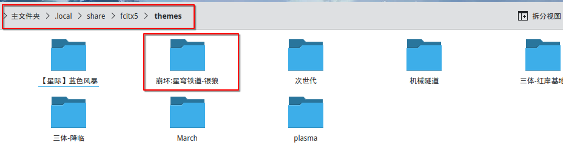

# fcitx5-SilverWolf-theme
转换自搜狗输入法皮肤格式(ssf)的银狼fcitx5主题，原作者是米游社用户: [MYG_寒](www.miyoushe.com/sr/accountCenter/postList?id=79952500 "MYG_寒的米游社主页")

主题原帖地址：

[https://www.miyoushe.com/sr/article/40199783](https://www.miyoushe.com/sr/article/40199783 "银狼输入法皮肤！作者：米游社用户:MYG_寒")

原作者百度网盘地址

[https://pan.baidu.com/s/1PwqQ9bx9hJnaGKptpUTUQQ?pwd=1123](https://pan.baidu.com/s/1PwqQ9bx9hJnaGKptpUTUQQ?pwd=1123 "银狼输入法皮肤！作者：米游社用户:MYG_寒")

转载已获得授权

# 安装

解压下载到的tar.gz包并复制主题目录到 ~/.local/share/fcitx5/themes/ 目录下。

如：

打开 fcitx5配置，选择 配置附加组件，经典用户界面栏点击配置，选择对应主题即可。

